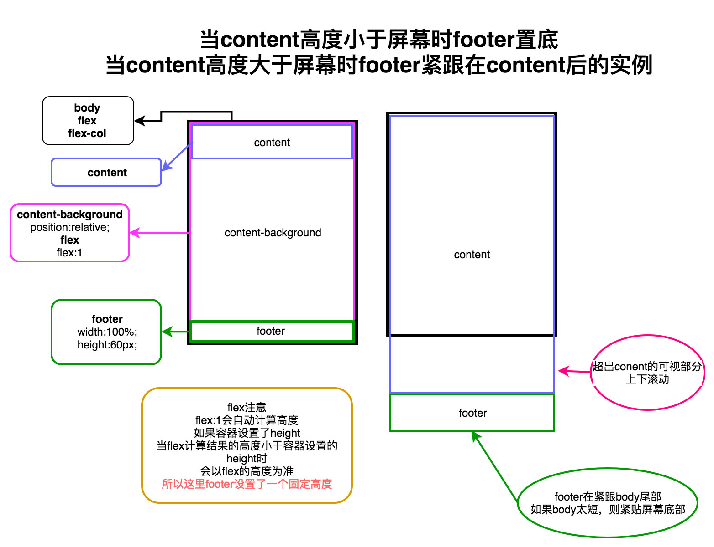

# 常用的移动WEB布局

* demo在LayoutDemo文件夹下，下载后可以直接运行 [点击链接](LayoutDemo)

 

 


# Flex运用页面基本框架

## 注意事项
* 一个元素指定了flex 横向排列后，其内部的元素默认会按照父元素的最大宽度进行平均排列，如果超出宽度则挤压，如果想突破父元素的宽度则指定width:max-content; 这个问题经常在做可以左右滚动的列表中出现


## 例子内用到的样式表
```
.flex-col{
	display: flex;
	lex-direction: column;
}
.flex-row{
	display: flex;
	lex-direction: row;
}
.flex-auto{
  flex-grow:1;
  box-flex:1;
}
```


### flex-auto的坑

```
<div class="flex-col" style="width:100%;height:300px;">

<div class="flex-auto flex-col" style="border:2px solid red;">
    <div class="flex-auto flex-col">
      <div id="box" style="width:100%;height:100%;background:black;"></div>
    </div>
</div>

<footer style="width:100%;border:2px solid green;">
  <div style="width:100%;height:60px;">
  </div>
</footer>

</div>
```
* 想一下id="box"的div现在应该是什么样？占据300-60高度填充了黑色？
* 其实box的高度是0，因为他的父级属性是`flex-auto`，一旦拥有`flex-auto`，那么当前div的高度不是由style的height决定，而是div内部子元素的总高度决定
* 修改一下
```
<div id="box" class="flex-auto" style="width:100%;height:100%;background:black;"></div>
```
* 这个时候就正确了,为什么呢？想一下~~~


### flex:1 自动平均分配空间的探索

```
<!--将box设置为竖向flex布局，里面元素flex:1平均分布-->
<box class="flex-col" style="width:100%;height:100%;">  
  <section style="flex:1"></section>
  <!--期望footer为一个固定80高度的容器，section则占用剩余部分全部高度-->  
  <footer style="height:80px"></footer>
</box>
```
然后我们开始变更 `section` 里面的内容，不断的增加内容的height值结果如下

  

本来我们代码的期望是`footer`保持`height:80px`高度不变，而现在`footer`被压缩了

解决方法有2种：
```
<box class="flex flex-col" style="width:100%;height:100%;">
    <section style="flex:1"></section>
    <footer>
    	<div style="height:80px"></div>
    </footer>
</box>
```
或者
```
<box class="flex flex-col" style="width:100%;height:auto;">
    <section style="flex:1"></section>
    <footer>
    </footer>
</box>
```

再来看一下结果


总结：
* 在使用flex:1时，`<box>`高度为固定值时，则会将`<section>`的高度去除后，将剩余高度分配给`<footer>`覆盖了`<footer>`原本设置的高度，在`<footer>`内部定义的dom设置高度，可以强行撑开`<footer>`
* 而`<box>`为auto时，因为高度空间有无限的高，所以`<section>`会根据自己内容而变更自身高度，不影响`footer`的高度。


