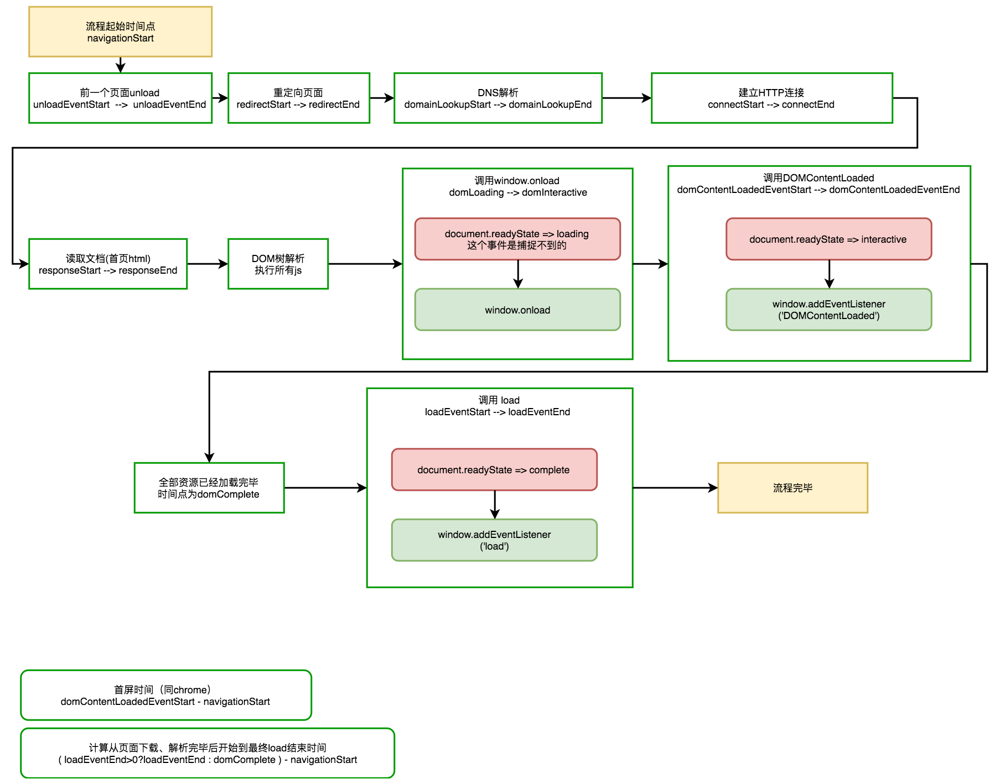

[TOC]
## 如果您喜欢我写的内容，那么给我一个星星吧！※

### select标签
  * 获取选项值的时候 dom.selectedOptions[0]不兼容，应该用dom.options[dom.selectIndex]获取到对象

### img标签
  * src为空的时候，display设置为none
  * 标签内最好添加 onerror=''  错误监听，不然可能引发全局异常

### input标签
  * 在禁止用户编辑的时候，设置readonly="readonly",不要用disabled
  * type为file的时候，如果display设置为none会导致某些机器无法正常使用，所以通过透明度来隐藏<div style="opacity:0;"><input /></div>
  * android机上，当软键盘弹出后可能会遮挡输入框，解决方法使用 scrollIntoViewIfNeeded
```
   window.addEventListener("resize", function() {
    if(document.activeElement){
      if(document.activeElement.tagName=="INPUT" || document.activeElement.tagName=="TEXTAREA") {
        if(document.activeElement.scrollIntoViewIfNeeded){
          window.setTimeout(function() {
            document.activeElement.scrollIntoViewIfNeeded();
          },0);
       }
      }
    }
  });
```
	* 用户体验的优化：
		* 获取输入内容时，用"".trim()去除首尾的空格
		* 如果要求任何空格或不可见字符不能出现在字符串内，则可以利用正则 "xxx".replace(/\s/g,"");//将不可见字符删除，提高准确率


### jsBrdge
  * (待验证)在安卓上通过JsBridge来传输BASE64字符串的话，需要UrlEncode两次后回调，不然会报异常

### 时间
  * 在IOS内使用new Date('12-01-02 12:02:02') 引发异常，应该使用 new Date('12/01/02 12:02:02') 或 new Date(时间戳)

### sessionStorage
  * 安卓手机QQ浏览器：在页面启动时（快速调用）sessionStorage.getItem( 'testSession' )
那么切换页面后sessionStorage会被清空
解决方法用window.name代替
```javascript
测试代码：
<script>

sessionStorage.getItem( 'testSession' );
window.onload = function(){

	document.getElementById('btnNext').onclick = function(e)
	{
			alert('ver5');
			alert(window.name);
			window.name = new Date().getTime();
			alert('写入时间:'+window.name);
			sessionStorage.setItem('testSession',"测试55678");

			location.href = 'testSession2.html?ver=2';
			return;


	};

};
</script>
```

### meta标签
  * <meta name="renderer" content="webkit">  开启其他浏览器高速模式
  * <meta http-equiv="X-UA-Compatible" content="IE=edge"> 让IE启用新的渲染模式
  * 非强制分辨率模式：<meta name="viewport" content="width=device-width,initial-scale=1,minimum-scale=1, maximum-scale=1,user-scalable=no">
  * 强制分辨率模式：
```javascript
<script>
var deviceWidth =  parseInt(window.screen.width);
var destWidth = 640;
var deviceScale = deviceWidth/destWidth;
var ua = navigator.userAgent;
if (/Android (\d+\.\d+)/.test(ua))
{
	var version = parseFloat(RegExp.$1);
	if(version>2.3){}
	else
	{
		deviceScale = destWidth/1000;
	}
	document.write('<meta name="viewport" content="width='+destWidth+',initial-scale='+deviceScale+', minimum-scale = '+deviceScale+', maximum-scale = '+deviceScale+', target-densitydpi=device-dpi">');
} 
else
{
	document.write('<meta name="viewport" content="width='+destWidth+', user-scalable=no">');
}
</script>
```

### 元素尺寸
  * 获取一个标签的真实宽度高度(比如<p>标签文字真实长度) dom.scrollWidth ,而获取一个标签的可视宽高度为 dom.clientWidth;
  * 获取屏幕的可视高度 window.screen.height*window.devicePixelRatio


### 优化
  * 在往DOM频繁或者插入大量元素的操作时，申请一个临时空间document.createDocumentFragment()，放入临时空间完成后一起加入到DOM

### SASS
  * 计算的值为%值时用percentage函数
```javascript
span {  
    width:percentage(2/3);  
} 
结果为
span {  
    width:66.66667%;  
}
```

  * 自动生成CSS并且CSS名字也是动态计算出来，#{$name}  替换生成名字的话需要#{}
```javascript
@mixin locate($name,$size:1)
{
        @keyframes #{$name}
	{
		0%{transform: scale(0);}
		100%{transform: scale($size);}
	}
}
```

### CSS
```
/*
 * 参数介绍
 * 中心定位XY坐标可能性:center/left bottom/10% 10%/12px 12px/
 * 圆的类型:contain/circle/ellipse  farthest-corner/closest-side
 * 可变长的颜色过渡列表:颜色1 所占百分比,颜色2 所占百分比....
 */
background: -webkit-radial-gradient(50% 50%,circle,rgba(255,255,255,1),rgba(255,255,255,.8),rgba(255,255,255,0),rgba(255,255,255,0));


	/*重复圆形渐变*/
	/*
	background:-webkit-repeating-radial-gradient(#ace, #ace 5px, #f96 5px, #f96 10px);
	*/
	
	/*重复线形渐变
	 * top 是从上到下、left 是从左到右，
	 */
	/*background:-webkit-repeating-linear-gradient(left, #ff0000,transparent );
	-webkit-background-size: 50px 50px;*/
	 background-color: #0ae;
	 background-image: -webkit-gradient(linear, 0 0, 0 100%, color-stop(.5, rgba(255, 255, 255, .2)), color-stop(.5, transparent), to(transparent));
```

### 滚动条
设置id为box的dom滚动条样式，要求在内容超出的时候显示滚动条，内容不超出的时候隐藏滚动条

CSS样式设置如下:

```
#box{
	overflow-y:auto;//如果需要一直显示则改为scroll
}

//接下来定义滚动条的样式
#box::-webkit-scrollbar-track
{
  -webkit-box-shadow: inset 0 0 6px rgba(0,0,0,0.3);
  border-radius: 10px;
  background-color: #F5F5F5;
}

#box::-webkit-scrollbar
{
  width: 12px;
  background-color: #F5F5F5;
}

#box::-webkit-scrollbar-thumb
{
  border-radius: 10px;
  -webkit-box-shadow: inset 0 0 6px rgba(0,0,0,.3);
  background-color: #D62929;
}
```


### ajax网络请求
  * 在调用ajax请求时，msg为字符串和msg为object，结果不同，代码如下：  
```javascript
var inter = "https://m.pre.nonobank.com/nono-web/weixinLoan/login";

var msg = 'image=data%3aimage%2fpng%3bbase64%2c';// image内为一个进行了urlEncode的BASE64图片代码
var settings =
{
 	type: "POST",
	data: msg,
	async: true,
	url:inter,
};
$.ajax(settings);
//在chrome内查看消息参数时，被解析为 image:data:image/png;base64

var msg2 =  {image:"data%3aimage%2fpng%3bbase64%2c" };
var settings2 =
{
 	type: "POST",
	data: msg2,
	async: true,
	url:inter,
};
$.ajax(settings2);
//在chrome内查看消息参数时，被解析为 image:data%3aimage%2fpng%3bbase64%2c

```
  * 可见在以对象传递给msg的时候，不会对里面的参数进行urldecode，而以string传递的时候则会进行一次urldecode
  * 所以在服务端收到消息的时候，建议都进行一次urldecode比较安全


### Chrome的插件和常用功能
	* 当我们变更过DNS后，强制清除CHROME的缓存方法
		* 地址栏打开 `chrome://net-internals/#capture` 点击右上角箭头
		* 分别执行 clear cache 和 flush sockets
	* 常用插件
		* CORS Toggle ： 允许跨域（注意需要设置header内允许的字段）
		* Ad Block ： 阻止弹出广告
		* FireShot ： 可以给网页截图（截取后下载到本地）
		* 网页截图:注释&批注 ： www.awesomescreenshot.com提供的，也是用来网页截图的，截图后还可以进行在线简单编辑后下载本地
		* Github Toc ： 让GITHUB内支持markdown的toc目录标签


 

### manifest使用方法  
* 创建 application.appcache 配置文件
	
~~~javascript
		CACHE MANIFEST
		#2015-5-20-18-02 这一行用来代表版本号
		testcache.html
~~~

* 头部定义缓存配置文件 `<html manifest='application.appcache'>`  
* 在页面内增加监听方法,目的是检测到缓存配置文件发生变化的话就重新载入页面  
~~~javascript
		window.applicationCache.onupdateready=function(e)
		{
			console.log('update cache');
			location.reload();
		};
~~~
	
### ES5中继承的方法
* 简单期间，封装了一个用于继承2个类的方法如下:

~~~javascript
	function ext(son,father){
		//先调用父类构造方法进行初始化
		father.apply(son,arguments[2]);
		//然后遍历当期那子类的所有方法，如果出现重复，则不用父类覆盖子类
		for( var param in father.prototype ){
			if( !son.__proto__[param ]){
				son.__proto__[param] = father.prototype[param];
			}
		}
	}
	
	//使用方法如下
	function Father(name){
		this.name= name;
	}
	Father.prototype.say = function(){
		console.log('father say ' + this.name);
	};

	function Son(name){
		ext(this,Father,arguments);
	}
	Son.prototype.say = function(){
		console.log('son say ' + this.name);
	};

~~~

### MAC OS开发常用软件
* git: SourceTree
* svn: Cornerstone  `http://www.zennaware.com/cornerstone/`
* 抓包: Charles
* git 对比: DiffMerge
* 修改host文件: iHosts
* 屏幕录像: LICEcap
* 远程服务器: zoc7
* 文件复制帮手: Yoink
* 压缩解压: The Unarchiver
* 代理软件: ShadowsocksX


### ajax相关
* 在zepto内默认的Content-Type为application/x-www-form-urlencoded
  
  当data为一个object时，zepto将会把它转换成key1=value1&key2=value2的形式，转换过程中，会对key和value进行urlencode。

  所以在服务器拿到消息时，会默认进行一次urldecode

  而如果data为一个字符串时，则zepto不会对其进行urlencode


### WEB加载的大致流程 - window.onload、DOMContentLoaded、load 之间的区别

* 我在这边画了一张流程图来展示整个url打开的过程  



* 总结一下
	* 1、几个load事件调用先后顺序 `window.onload` -> `DOMContentLoaded` -> `load`
	* 2、其中`DOMContentLoaded`代表已经首屏展示（如果你没有强制设置隐藏的话）、load事件代表全部非异步加载的资源全部就绪了。
	* 提高页面加载速度的技巧：
		* 减少非首屏必须的js和css加载，可以放入load后异步加载
		* `load`事件会等待页面所有资源加载完毕后才触发，所以类似img标签的图片资源加载过程是不影响`DOMContentLoaded`事件的触发的，但是只有当img全部加载完毕才会触发load,优化方法是img src使用默认一张统一的图片，然后在`load`事件后异步加载.

### 其他
* Object.assign在安卓浏览器上存在兼容问题,解决方案如下：

```javascript
//注意这里是非深度拷贝

if (typeof Object.assign != 'function') {
  // Must be writable: true, enumerable: false, configurable: true
  Object.defineProperty(Object, "assign", {
    value: function assign(target, varArgs) { // .length of function is 2
      'use strict';
      if (target == null) { // TypeError if undefined or null
        throw new TypeError('Cannot convert undefined or null to object');
      }

      var to = Object(target);

      for (var index = 1; index < arguments.length; index++) {
        var nextSource = arguments[index];

        if (nextSource != null) { // Skip over if undefined or null
          for (var nextKey in nextSource) {
            // Avoid bugs when hasOwnProperty is shadowed
            if (Object.prototype.hasOwnProperty.call(nextSource, nextKey)) {
              to[nextKey] = nextSource[nextKey];
            }
          }
        }
      }
      return to;
    },
    writable: true,
    configurable: true
  });
}
```
