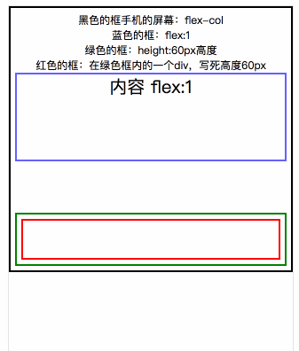

# Flex运用页面基本框架

## 例子内用到的样式表
```
.flex-col{
	display: flex;
	lex-direction: column;
}
.flex-row{
	display: flex;
	lex-direction: row;
}
```

### flex:1 自动平均分配空间的探索

```
<!--将box设置为竖向flex布局，里面元素flex:1平均分布-->
<box class="flex-col" style="width:100%;height:100%;">  
  <section style="flex:1"></section>
  <!--期望footer为一个固定80高度的容器，section则占用剩余部分全部高度-->  
  <footer style="height:80px"></footer>
</box>
```
然后我们开始变更 `section` 里面的内容，不断的增加内容的height值结果如下

  

本来我们代码的期望是`footer`保持`height:80px`高度不变，而现在`footer`被压缩了

原因是在一个设置了`固定高度`的 `box` 中内的元素由于设置了flex:1，子元素会将其元素内的内容高度所占用`box`的内容高度去除后
`box`剩下高度平均分给各个同级的子元素,这里一旦超出了100%后由于剩余空间不足，则会压缩footer;

那么如何达到footer的期望效果呢？那就是让footer内的内容自身高度保持在80px


```
<box class="flex flex-col" style="width:100%;height:100%;">
    <section style="flex:1"></section>
    <footer>
    	<div style="height:80px"></div>
    </footer>
</box>
```

再来看一下结果



总结：
在使用flex:1自动填充属性的时候，如果期望一些元素高度有固定值，那么不是在这个子元素身上设置高度，而是应该在其内部用其他元素填充这个高度。


